<!--
  Every image on this page is drawn by scripts/build.py and committed to assets/;
  activity, languages and the footer are rebuilt nightly from the GitHub API by
  .github/workflows/profile.yml. Change the design in the script, not the SVGs.

  LAYOUT RULES - break these and the rows stop lining up:
  * One row per line, and NO whitespace between the images in a row. GitHub
    renders whitespace between inline images as a gap, which pushes a row of
    exact widths off the grid.
  * Widths are exact fractions: 100%, 50%, 33.33%, 25%. Every SVG carries the
    same side padding, so these produce flush outer edges and equal gutters.
  * No  . Each row is its own paragraph, which is what keeps the vertical
    rhythm even; section headers carry their own top space.
-->


<picture><source media="(prefers-color-scheme: dark)" srcset="assets/h-01-dark.svg" />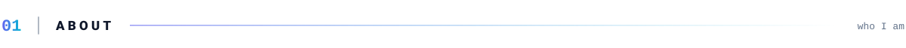</picture>


<picture><source media="(prefers-color-scheme: dark)" srcset="assets/h-02-dark.svg" />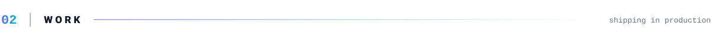</picture>

<a href="https://play.google.com/store/apps/details?id=com.nexaride.userapp"></a>

<a href="https://www.dendo.in">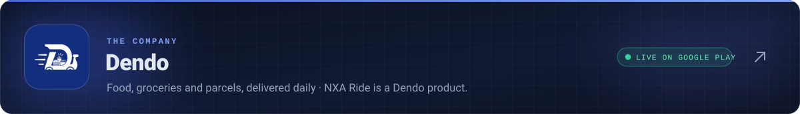</a>

<picture><source media="(prefers-color-scheme: dark)" srcset="assets/h-03-dark.svg" />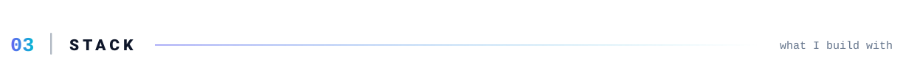</picture>

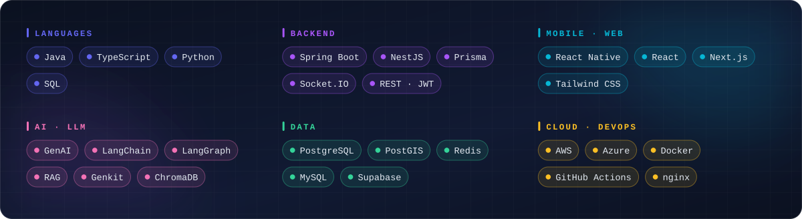

<picture><source media="(prefers-color-scheme: dark)" srcset="assets/h-04-dark.svg" />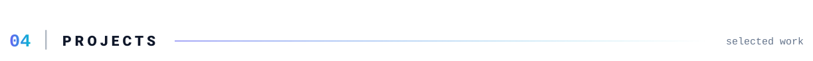</picture>

<a href="https://github.com/TheParthi/Malware-Detection-GenAI">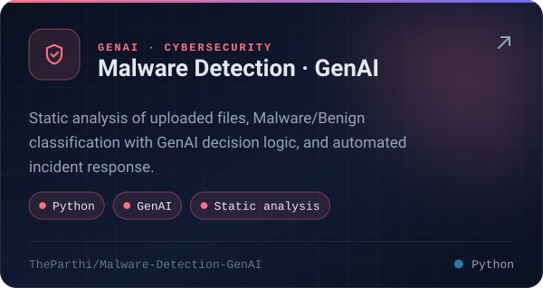</a><a href="https://github.com/TheParthi/Email_rag">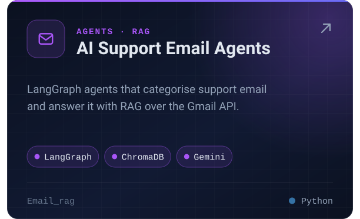</a>

<a href="https://github.com/TheParthi/Loanify">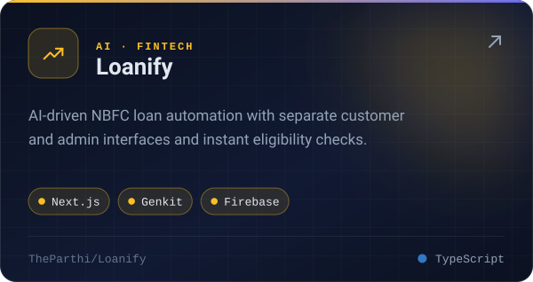</a><a href="https://github.com/TheParthi/Security_monitor">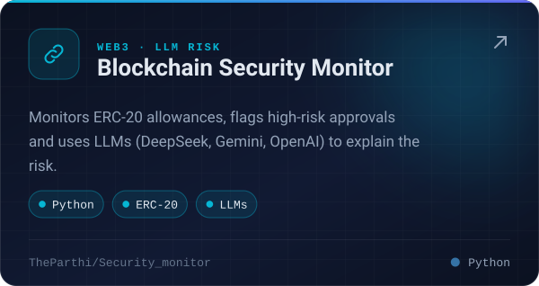</a>

<a href="https://github.com/TheParthi/Freelancer_Marketplace_TrustLance">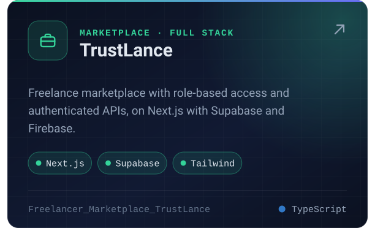</a><a href="https://github.com/TheParthi/secure-cloud-storage-backup-system">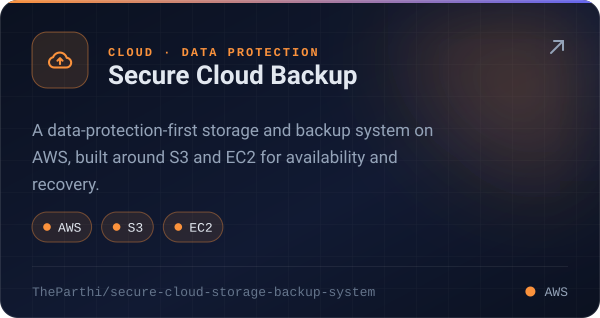</a>

<picture><source media="(prefers-color-scheme: dark)" srcset="assets/h-05-dark.svg" />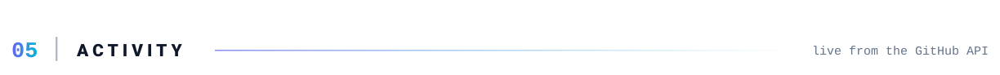</picture>

<a href="https://github.com/TheParthi">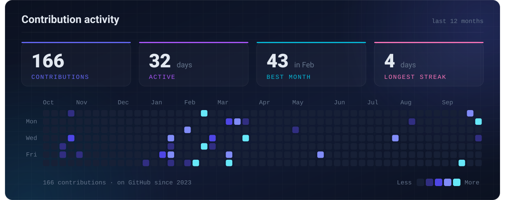</a>

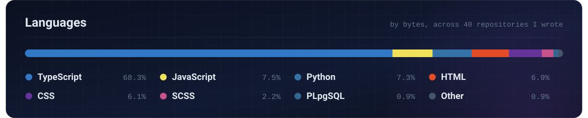

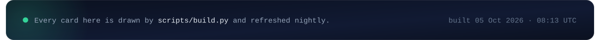
